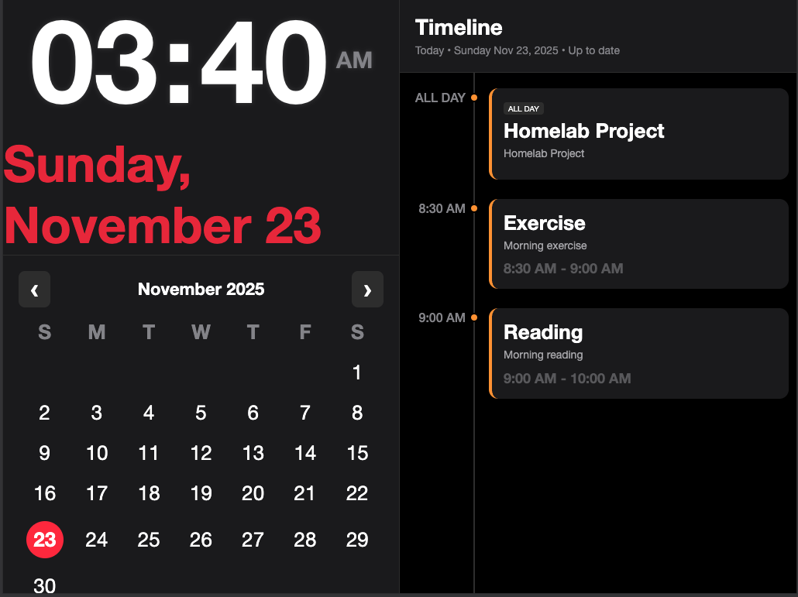

# Event Calendar

A modern, dark-themed calendar application designed for iPad Mini, featuring a real-time clock, monthly calendar view, and event timeline with PostgreSQL integration.



## Features

- **Real-time Clock**: Large, bold digital clock with 12-hour format and leading zeros
- **Voice Time Announcement**: Automatic time announcements every 30 minutes (at :00 and :30)
- **Monthly Calendar View**: Interactive calendar grid highlighting the current date
- **Event Timeline**: Vertical timeline displaying events with priority-based color coding and delete functionality
- **PostgreSQL Integration**: Robust database backend for event storage
- **Auto-refresh**: Events automatically refresh every minute
- **iPad Mini Optimized**: Designed specifically for iPad Mini with responsive layout
- **Dark Theme**: Modern dark mode interface with high contrast

## Tech Stack

- **Backend**: Node.js, Express.js
- **Database**: PostgreSQL
- **Frontend**: EJS templates, vanilla JavaScript, CSS3
- **Containerization**: Docker, Docker Compose
- **CI/CD**: GitHub Actions for automated Docker image builds

## Prerequisites

- Node.js 18+ (or Docker)
- PostgreSQL 15+ (or use Docker Compose)
- npm or yarn

## Installation

### Using Docker Compose (Recommended)

1. Clone the repository:
```bash
git clone <repository-url>
cd event-calendar
```

2. Create a `.env` file:
```env
DB_HOST=postgres
DB_PORT=5432
DB_DATABASE=event_calendar
DB_USERNAME=postgres
DB_PASSWORD=postgres
APP_PORT=3000
NODE_ENV=production
```

3. Start the application:
```bash
docker-compose up -d
```

The application will be available at `http://localhost:3000`

### Manual Installation

1. Clone the repository:
```bash
git clone <repository-url>
cd event-calendar
```

2. Install dependencies:
```bash
npm install
```

3. Set up PostgreSQL database:
```sql
CREATE DATABASE event_calendar;

CREATE TABLE calendar_events (
    id SERIAL PRIMARY KEY,
    date DATE NOT NULL,
    title VARCHAR(255) NOT NULL,
    description TEXT,
    start_time TIME,
    end_time TIME,
    priority VARCHAR(20) DEFAULT 'medium',
    all_day BOOLEAN DEFAULT false
);
```

4. Create a `.env` file:
```env
DB_HOST=localhost
DB_PORT=5432
DB_DATABASE=event_calendar
DB_USERNAME=postgres
DB_PASSWORD=your_password
```

5. Start the application:
```bash
npm start
```

For development with auto-reload:
```bash
npm run dev
```

## Project Structure

```
event-calendar/
├── bin/
│   └── www                 # Application entry point
├── config/
│   └── database.js         # PostgreSQL connection pool
├── public/
│   ├── images/            # Static images
│   ├── javascripts/
│   │   └── calendar.js     # Frontend JavaScript
│   └── stylesheets/
│       └── calendar.css    # Application styles
├── routes/
│   ├── index.js            # Home route
│   └── events.js           # Events API routes
├── views/
│   ├── index.ejs           # Main calendar view
│   └── error.ejs           # Error page
├── app.js                  # Express application setup
├── Dockerfile              # Production Docker image
├── docker-compose.yml      # Production Docker Compose
└── docker-compose.dev.yml # Development Docker Compose
```

## API Endpoints

### GET `/api/events/:date`

Retrieve events for a specific date.

**Parameters:**
- `date` (string, required): Date in YYYY-MM-DD format

**Example:**
```bash
GET /api/events/2025-11-23
```

**Response:**
```json
[
  {
    "id": 123,
    "date": "2025-11-23",
    "title": "Drawing / Art Time",
    "description": "test",
    "start_time": "20:30:00",
    "end_time": "23:30:00",
    "priority": "medium",
    "all_day": false
  }
]
```

### DELETE `/api/events/:id`

Delete an event by ID.

**Parameters:**
- `id` (integer, required): Event ID

**Example:**
```bash
DELETE /api/events/123
```

**Response (200 OK):**
```json
{
  "message": "Event deleted successfully",
  "id": 123
}
```

**Error Responses:**

- `400 Bad Request`: Invalid event ID format
- `404 Not Found`: Event with specified ID not found
- `500 Internal Server Error`: Database error

### POST `/api/events`

Create a new event manually.

**Request Body:**
- `date` (string, required): Date in YYYY-MM-DD format
- `title` (string, required): Event title
- `description` (string, optional): Event description
- `start_time` (string, optional): Start time in HH:MM or HH:MM:SS format (required if not all_day)
- `end_time` (string, optional): End time in HH:MM or HH:MM:SS format
- `priority` (string, optional): Priority level - 'low', 'medium', or 'high' (default: 'medium')
- `all_day` (boolean, optional): Whether event is all-day (default: false)

**Example Request:**
```bash
POST /api/events
Content-Type: application/json

{
  "date": "2025-11-23",
  "title": "Drawing / Art Time",
  "description": "Creative art session",
  "start_time": "20:30",
  "end_time": "23:30",
  "priority": "medium",
  "all_day": false
}
```

**Example Request (All-Day Event):**
```bash
POST /api/events
Content-Type: application/json

{
  "date": "2025-11-24",
  "title": "Holiday",
  "description": "Public holiday",
  "all_day": true,
  "priority": "high"
}
```

**Response (201 Created):**
```json
{
  "id": 123,
  "date": "2025-11-23",
  "title": "Drawing / Art Time",
  "description": "Creative art session",
  "start_time": "20:30:00",
  "end_time": "23:30:00",
  "priority": "medium",
  "all_day": false
}
```

**Error Responses:**

- `400 Bad Request`: Invalid date format, missing required fields, or invalid priority
- `500 Internal Server Error`: Database error

## Database Schema

### calendar_events Table

| Column | Type | Description |
|--------|------|-------------|
| `id` | SERIAL | Primary key |
| `date` | DATE | Event date (YYYY-MM-DD) |
| `title` | VARCHAR(255) | Event title |
| `description` | TEXT | Event description |
| `start_time` | TIME | Start time (HH:MM:SS) |
| `end_time` | TIME | End time (HH:MM:SS) |
| `priority` | VARCHAR(20) | Priority: 'low', 'medium', 'high' |
| `all_day` | BOOLEAN | Whether event is all-day |

## Docker Deployment

### Building Docker Image

```bash
docker build -t event-calendar .
```

### Running with Docker Compose

**Production:**
```bash
docker-compose up -d
```

**Development:**
```bash
docker-compose -f docker-compose.dev.yml up
```

### GitHub Container Registry

The project includes GitHub Actions workflow that automatically builds and pushes Docker images to GitHub Container Registry (GHCR) when version tags are pushed:

```bash
git tag v1.0.0
git push origin v1.0.0
```

Images are available at: `ghcr.io/<username>/event-calendar:v1.0.0`

## Environment Variables

| Variable | Description | Default |
|----------|-------------|---------|
| `DB_HOST` | PostgreSQL host | `localhost` |
| `DB_PORT` | PostgreSQL port | `5432` |
| `DB_DATABASE` | Database name | `event_calendar` |
| `DB_USERNAME` | Database username | `postgres` |
| `DB_PASSWORD` | Database password | - |
| `APP_PORT` | Application port | `3000` |
| `NODE_ENV` | Environment | `production` |

## Features in Detail

### Clock Display
- Updates every second
- 12-hour format with AM/PM
- Leading zeros for single-digit hours
- Large, bold font for wall readability

### Voice Time Announcement
- **Manual Announcement**: Click the 🔊 button to hear the current time spoken aloud
- **Automatic Announcements**: After clicking the 🔊 button once, the app will automatically announce the time every 30 minutes (at :00 and :30)
- **Browser Compatibility**: Works with Web Speech API (Safari, Chrome, Firefox)
- **iPad Mini 1 Optimized**: Includes special handling for device sleep and background execution
- **Time Format**: Announces time in natural language (e.g., "Time now is Two Thirty Five PM")
- **Note**: User interaction (clicking the 🔊 button) is required once to enable automatic announcements due to browser security restrictions

### Calendar View
- Current month display
- Today's date highlighted in red circle
- Responsive grid layout

### Event Timeline
- Color-coded by priority:
  - **Red**: High priority
  - **Orange**: Medium priority
  - **Green**: Low priority
- All-day events displayed at the top
- Time range display for timed events
- Auto-refresh every 60 seconds

## Development

### Running in Development Mode

```bash
npm run dev
```

This uses `nodemon` for automatic server restarts on file changes.

### Code Structure

- **Frontend**: Vanilla JavaScript (no frameworks) for maximum compatibility with older iPad Minis
- **Styling**: CSS3 with webkit prefixes for iOS compatibility
- **Backend**: Express.js with EJS templating
- **Database**: PostgreSQL with connection pooling

## Browser Compatibility

- Safari (iOS 9+)
- Chrome (latest)
- Firefox (latest)
- Optimized for iPad Mini

## License

Private project

## Contributing

This is a private project. For issues or suggestions, please contact the maintainer.

